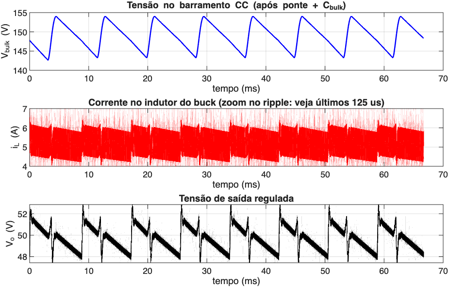
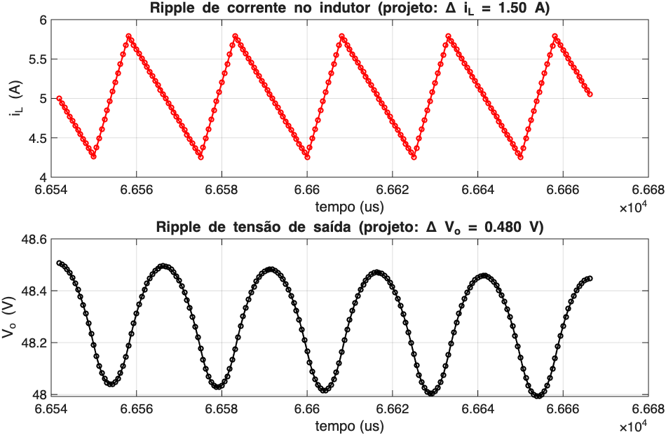

## Objetivos da Apresentação

- Apresentar a topologia completa: rede CA $\to$ ponte retificadora $\to$ buck $\to$ carga
- Percorrer o **passo a passo** de dimensionamento (script [`FonteControlada.m`](FonteControlada.m))
- Verificar o projeto por **simulação comportamental** no tempo
- Discutir a divergência encontrada entre projeto analítico e simulação
- Apontar como o modelo de pequenos sinais do Buck (ver [outra apresentação](../Apresentacao/Apresentacao.html)) fecha essa lacuna

---

## Topologia Geral

```{mermaid}
flowchart LR
    AC["Rede CA<br/>110 V, 60 Hz"] --> BR["Ponte<br/>Retificadora"]
    BR --> CB["C_i"]
    CB --> BK["Buck<br/>(S, D, L)"]
    BK --> CO["C"]
    CO --> LOAD["Carga R"]
```

- Ponte de diodos + $C_i$: retifica e filtra a rede CA em um barramento CC
- Buck: regula o barramento (variável, com ripple de baixa frequência) para $V_o$ constante
- $C$: filtra o ripple de chaveamento na saída

---

## Especificações de Projeto

| Parâmetro | Símbolo | Valor |
|---|:---:|:---:|
| Tensão eficaz da rede | $V_{rms}$ | 110 V |
| Frequência da rede | $f_r$ | 60 Hz |
| Tensão de saída regulada | $V_o$ | 48 V |
| Corrente máxima de carga | $I_o$ | 5 A |
| Frequência de chaveamento | $f_s$ | 40 kHz |
| Ripple do barramento CC | $\Delta V_i$ | 8 % de $V_p$ |
| Ripple de corrente no indutor | $\Delta I$ | 30 % de $I_o$ |
| Ripple de tensão de saída | $\Delta V_o$ | 1 % de $V_o$ |
| ESR do capacitor de saída | $R_e$ | 20 mΩ |
| Eficiência estimada | $\eta$ | 93 % |

---

## Passo 1 — Retificação de Onda Completa

Tensão de pico retificada (diodos ideais):

$$
V_p = V_{rms}\sqrt{2} = 110\sqrt{2} \approx \boxed{155{,}6\text{ V}}
$$

::: {.note}
Ponte completa: dois diodos em condução a cada semiciclo, cada um bloqueando $V_p$ no semiciclo oposto.
:::

---

## Passo 1 — Potência e Corrente do Barramento

$$
P = V_o I_o = 48\times5 = 240\text{ W}, \qquad
P_i = \frac{P}{\eta} = \frac{240}{0{,}93} \approx 258{,}1\text{ W}
$$

$$
I_i = \frac{P_i}{V_p} = \frac{258{,}1}{155{,}6} \approx \boxed{1{,}66\text{ A}}
$$

---

## Passo 1 — Capacitor de Barramento

Ripple de tensão no barramento, em $2f_r$ (retificação de onda completa):

$$
C_i = \frac{I_i}{2f_r\,\Delta V_i}
$$

| Grandeza | Valor |
|---|:---:|
| $\Delta V_i$ (8 % de $V_p$) | 12,5 V |
| $C_i$ | **1111 µF** |
| Faixa de $V_i$ | 143 V – 156 V |
| Tensão nominal do capacitor (margem 20 %) | ≥ 187 V |

---

## Passo 2 — Faixa de Razão Cíclica

Em regime, $V_o = D\,V_i$; como $V_i$ tem ripple, $D$ varia com ele:

$$
D_{\min} = \frac{V_o}{V_{i,\max}} \approx 0{,}31, \qquad
D_{\max} = \frac{V_o}{V_{i,\min}} \approx 0{,}34
$$

::: {.callout-insight}
O ripple do indutor é máximo quando $D\to0{,}5$. Como $D$ não chega a $0{,}5$, o pior caso é o extremo mais próximo dele: aqui, $D_{\max}=0{,}34$, em $V_i=V_{i,\min}=143$ V.
:::

---

## Passo 2 — Indutor

Projetado no ponto de pior caso ($D=0{,}34$, $V_i=143$ V):

$$
L = \frac{(V_i-V_o)\,D}{f_s\,\Delta I}
$$

| Grandeza | Valor |
|---|:---:|
| $L$ | **532 µH** |
| $\Delta I$ (30 % de $I_o$) | 1,5 A |
| $I_{pk}$ | 5,75 A |
| $I_{rms}$ | 5,02 A |

::: {.callout-question}
O indutor garante condução contínua (MCC) na carga nominal?
:::

::: {.callout-insight}
Sim: a corrente crítica é $\Delta I/2=0{,}75$ A, bem abaixo de $I_o=5$ A. **CCM garantido.**
:::

---

## Passo 2 — Capacitor de Saída

Ripple de saída dividido entre a queda na ESR e o termo capacitivo:

$$
\Delta V_R = \Delta I\,R_e, \qquad
C = \frac{\Delta I}{8\,f_s\,\Delta V_C}
$$

| Grandeza | Valor |
|---|:---:|
| $\Delta V_o$ alvo (1 % de $V_o$) | 0,48 V |
| $\Delta V_R$ (contribuição da ESR) | 0,03 V |
| $\Delta V_C$ (restante, para o capacitor) | 0,45 V |
| $C$ | **10,4 µF** |

---

## Passo 3 — Chave e Diodo do Buck

$$
I_{sw} = I_o\sqrt{D}, \qquad
I_{D,med} = I_o(1-D), \qquad
I_{D,rms} = I_o\sqrt{1-D}
$$

| Componente | Bloqueio | Corrente |
|---|:---:|:---:|
| Chave (MOSFET) | $\ge$ 143 V | $I_{sw}=2{,}90$ A |
| Diodo de roda-livre | $\ge$ 143 V | $I_{D,med}=3{,}32$ A, $I_{D,rms}=4{,}08$ A |

---

## Passo 3 — Diodos da Ponte

- Bloqueio: $V_p\approx156$ V
- Dois diodos conduzem por semiciclo, cada um com corrente média $I_b = I_i/2\approx0{,}83$ A

---

## Passo 4 — Modelo de Simulação

::: {.incremental}
- **Ponte + $C_i$**: carga/descarga do capacitor, com resistência série limitando o pico de corrente
- **Buck**: chaveamento ideal em MCC, com duty-cycle *feedforward* $D(t)=V_o/V_i(t)$
- **Saída**: $C$ + ESR, carga resistiva equivalente a $I_o$
- Integração explícita, 4 ciclos de linha
:::

::: {.note}
Sem malha de realimentação: $D(t)$ usa só o valor instantâneo de $V_i$, sem medir $V_o$.
:::

---

## Passo 4 — Sinais Simulados

{width="82%" fig-align="center"}

---

## Passo 4 — Zoom no Ripple de Chaveamento

{width="72%" fig-align="center"}

---

## Passo 5 — Projeto × Simulação

| Grandeza | Projeto | Simulado |
|---|:---:|:---:|
| $\Delta V_i$ | 12,5 V | 10,7 V |
| $\Delta I$ | 1,5 A | 2,3 A |
| $\Delta V_o$ | **0,48 V** | **5,39 V** |

::: {.callout-question}
Por que o ripple de saída simulado é **~11×** maior que o projetado, se $L$ e $C$ foram dimensionados corretamente para o ripple de chaveamento?
:::

::: {.callout-insight}
As fórmulas de $L$ e $C$ só cobrem o ripple **de chaveamento**. O *feedforward* $D(t)=V_o/V_i(t)$ é em **malha aberta**: qualquer imperfeição de modelo deixa passar o ripple de baixa frequência do barramento (120 Hz) direto para a saída — e é esse componente, não coberto pelas fórmulas de chaveamento, que domina o $\Delta V_o$ simulado.
:::

---

## Conclusões

- Especificações de chaveamento atendidas: CCM garantido, esforços de semicondutores com margem confortável
- Barramento e indutor dimensionados de forma consistente e verificados por simulação
- **Lacuna identificada**: o *feedforward* em malha aberta não rejeita o ripple de baixa frequência do barramento — o $\Delta V_o$ real é dominado por esse efeito, não pelo ripple de chaveamento

---

## Próximos Passos

::: {.incremental}
1. Fechar a malha de tensão com um controlador projetado a partir de $G_{vd}(s)$ (ver [modelo de pequenos sinais](../Apresentacao/Apresentacao.html))
2. Reavaliar o orçamento de $C$ incluindo a rejeição ao ripple de 120 Hz, não só o de chaveamento
3. Comparar, na mesma simulação, *feedforward* puro vs. malha fechada (PI/PID)
4. Validar fisicamente seguindo o roteiro de bancada de [@dilger2018]
:::

---

## Referências

::: {#refs}
:::
